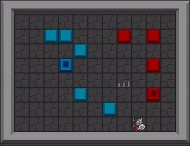
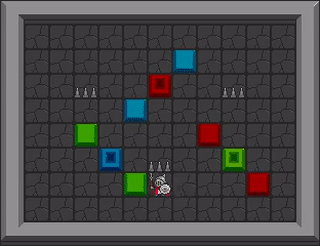
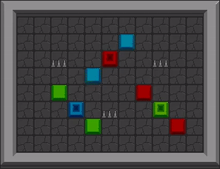

# Conditional Action Trees

This repository complements the "Conditional Actions Tree" paper.

arxiv link here soon!





# Discord Community For Support

For any support questions please join the [Griddly Discord Community](https://discord.gg/xuR8Dsv)

## Install Griddly

These experiments use several custom griddly environments.

```
pip install griddly
```


## Install Dependencies for this experiment

First navigate to this directory then:

```
pip install -r requirements.txt
```

## :warning: Rllib < 1.3.0 :warning: 

The current master of rllib has some bugs that are fixed on our own RLLib branch which can be found here:

```
git clone git@github.com:Bam4d/ray.git
```

## Running experiments

You can copy any of the following lines to run any of the experiments in the paper.

#### No Masking

```
rllib_baseline.py  --experiment-name="M" --yaml-file="clusters_po.yaml"
rllib_baseline.py  --experiment-name="MP" --yaml-file="clusters_po_with_push.yaml"
rllib_baseline.py  --experiment-name="MPS" --yaml-file="clusters_po_with_push_separate_colors.yaml"
rllib_baseline.py  --experiment-name="Ma" --yaml-file="clusters_po_with_push_units.yaml"
rllib_baseline.py  --experiment-name="MSa" --yaml-file="clusters_po_with_push_separate_colors_units.yaml"
```

#### Depth-2

```
rllib_baseline_flat.py  --experiment-name="M" --yaml-file="clusters_po.yaml"
rllib_baseline_flat.py  --experiment-name="MP" --yaml-file="clusters_po_with_push.yaml"
rllib_baseline_flat.py  --experiment-name="MPS" --yaml-file="clusters_po_with_push_separate_colors.yaml"
rllib_baseline_flat.py  --experiment-name="Ma" --yaml-file="clusters_po_with_push_units.yaml"
rllib_baseline_flat.py  --experiment-name="MSa" --yaml-file="clusters_po_with_push_separate_colors_units.yaml" 
```

#### CAT_CL + CAT_CD

Both runs in these experiments run consecutively using ray's `grid_search` method

```
rllib_conditional_actions.py  --experiment-name="M" --yaml-file="clusters_po.yaml"
rllib_conditional_actions.py  --experiment-name="MP" --yaml-file="clusters_po_with_push.yaml"
rllib_conditional_actions.py  --experiment-name="MPS" --yaml-file="clusters_po_with_push_separate_colors.yaml"
rllib_conditional_actions.py  --experiment-name="Ma" --yaml-file="clusters_po_with_push_units.yaml"
rllib_conditional_actions.py  --experiment-name="MSa" --yaml-file="clusters_po_with_push_separate_colors_units.yaml"
```


## Griddly + RLLib 

The experiments are performed using several custom RLLib classes:

### ConditionalActionImpalaTrainer

Contains the code for setting up the mixin and the modified vtrace policy

### ConditionalActionMixin

Overrides the typical policy rollout method to use the Conditional Action Trees when sampling actions

### ConditionalActionVTraceTorchPolicy

Applies constructed masks to the vtrace policy

### TorchConditionalMaskingExploration

Contains the tree traversal and mask creation code

## Environments

The 5 environments that are used for the paper are contained in this repository with filenames similar to `clusters_po....yaml`

They are all based on the `Clusters` environment which has full documentation [here](https://griddly.readthedocs.io/en/latest/games/Clusters/index.html)

## Wandb

View all of the experiments, training results and videos [here](https://wandb.ai/chrisbam4d/conditional_action_trees)
